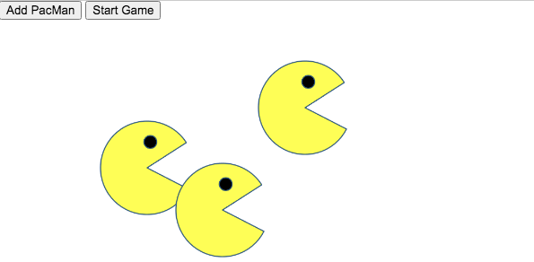

# PacMen Factory Exercise
## Description
This exercise creates a factory that builds an infinite number of Pac Men and then moves them randomly across the screen.  Each Pac Man should recognize screen limitations and change direction at outer limits.
## How to run
Fork and download code to a directory on your computer.  Open index.html within your browser to execute
## Future Roadmap
This project was meant as an exercise.  At this time, now future development is planned.

